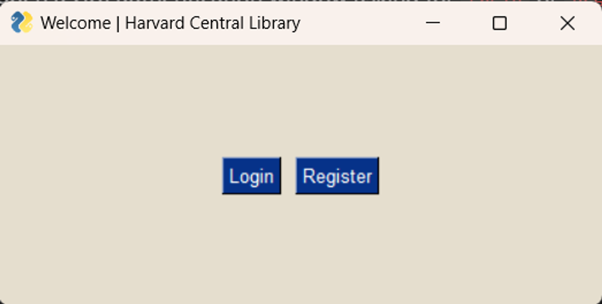
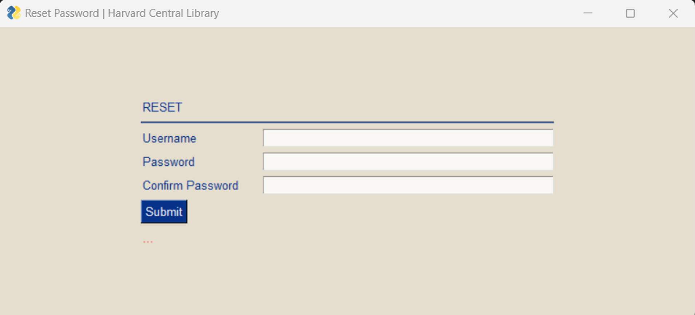
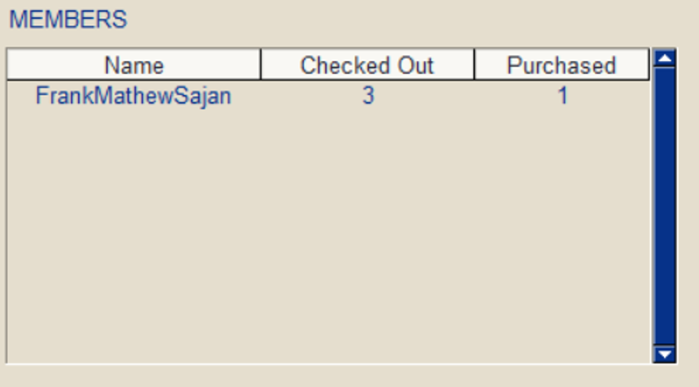
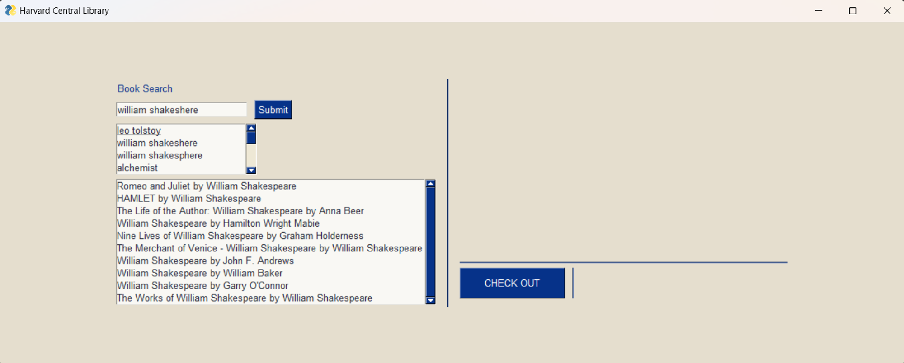

# Library Management Model

# Table of Contents
1. [Description](#description)
2. [Installation](#installation)
3. [Usage](#usage)
4. [Screenshots and Usage](#screenshots-and-usage)
5. [File Structure](#project-structure) 
6. [Project Reflection](#project-reflection)

## Description
The Library Management Model is a user-friendly GUI-based application designed for efficiently managing a library. The project utilizes a Python-based frontend framework called PySimpleGUI and relies on the Python programming language for implementation. The database is managed using SQLite3.

## Installation
Before running the script, make sure to install the required Python libraries by executing the following commands in your terminal:

```bash
pip install -r requirements.txt
```

## Usage
To run the script, navigate to the directory containing the script and execute the following command:

```bash
python project.py
```

This will open a GUI authentication window asking for Login or Register. Follow the instructions in the window as it is.

Use the following credentials to log in for review purposes.

```
Username: FrankMathewSajan
Password: Frank@2005
```

## Screenshots and Usage



Welcome Page: If you're not logged in, you have options to either `Login` or `Register`.


Register Page: You can register as a new user here.


Login Page: Log in using the demo credentials or the newly registered credentials.

Reset Password Button: Opens a GUI for resetting the user’s password.



**Reset Password Page:** Let the user change their password, assuming the account exists, and the new password is confirmed.


**Home Page:** After logging in, you'll land on the system's Home page. By default, the library is titled 'Harvard Central Library', but you can modify this `TITLE` in the `__init__.py` file located in the `classes` folder.

**Checkouts:** Displays the images of the checked-out books. Clicking on each book will trigger `Accounts.return()`. This action will check the book back in and deduct any late submission fines, if applicable.


**CHECKED OUT:** Displays the name of the checked-out book and its author in a table.


**PURCHASED:** Displays the name of the books purchased and their author on a table.


**MEMBERS:** Displays the name, number of books checked out, and number of books purchased by other members.



**TRANSACTIONS:**


Enter the amount of money to add to the account in the input box. If the balance falls below zero due to any fines, all services, such as checkout, will be blocked until the balance is cleared.


**LIBRARY SECTION**


**Reset Password:** This opens the Reset Password Page.


**Full Screen:** This maximizes the window.

**Logout:** This logs out the current user.

**Refresh:** This refreshes the page with new information.

**Delete Account:** This deletes the account and its data.


**Search NEW Books & See Available Books:**

  ****


Both interfaces have the same GUI. The only difference is that `Search NEW Books` uses the `Google Books API` to search online. The small box below the search bar displays suggestions and recently searched books.



When the search button is pressed, a list of 10 books is displayed along with a preview. This preview includes a description, price, type, maturity rating, and the number of pages with the book preview, if the network is available.

 


**CHECKOUT:** Check out the selected book.


There is a checkout limit of 3 books. This can be changed in `CHECKOUT_LIMIT` `classes.__init__.py`

**Buy:** You can purchase a book if it's available for sale and you have sufficient balance.


## Technical Side & Source Code

The entire source code is hosted on GitHub.

[Frank Mathew Sajan - Github](https://github.com/frankmathewsajan/library-management-system)

**Front-End:** PySimpleGUI, Python

**Database:** SQLite3

## Project Structure

```
Folder PATH listing
Volume serial number is 84B5-0564
C:.
│   log.txt
│   project.py
│   README.md
│   requirements.txt
│   test_project.py
│
├───assets
│   │   1.png
│   │   2.png
│   │   3.png
│   │   image.png
│   │
│   └───Screenshots
│           Authentication.png
│           Buy1.png
│           Buy2.png
│           Buy3.png
│           CheckedOut.png
│           CheckedOutDone.png
│           CheckOutP.png
│           CheckOutPreview.png
│           Checkouts.png
│           Delete.png
│           Home.png
│           LibSection.png
│           Members.png
│           Purchased.png
│           Reciept.png
│           Register.png
│           ResetPassword.png
│           SeeAvail.png
│           Suggestions.png
│           Trans.png
│           Welcome1.png
│
├───classes
│       Accounts.py
│       Database.py
│       Layouts.py
│       Library.py
│       __init__.py
│
└───databases
        sqlite.db
```

The file structure is organized with self-explanatory names. Key components include:

- `project.py`: The main script for running the Library Management Model.
- `README.md`: The documentation file you are currently reading.
- `requirements.txt`: Contains the required Python libraries for the project.
- `assets`: Directory containing image assets used in the application.
- `classes`: Python modules for various functionalities such as accounts, database handling, layouts, and library operations.
- `databases`: Location of the SQLite3 database file.

## Project Reflection

This project offers a library management system with a SQLite3 database. The PySimpleGUI interface provides intuitive navigation. Proficiency in PySimpleGUI and SQLite3 was required . This README.md provides comprehensive documentation.